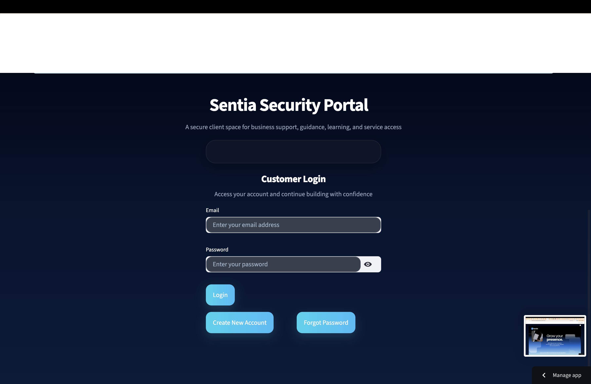

# 🔐 Sentia Security Portal (ML-Based Intrusion Detection System)

A web-based cybersecurity platform integrating a Machine Learning-Based Intrusion Detection System (MLBIDS) for analysing network traffic, detecting threats, and supporting security decision-making.

This project was developed as part of my MSc Applied Cybersecurity research, focusing on the implementation and evaluation of machine learning models for intrusion detection in a simulated real-world environment.

---

## 🌐 Live Application

The application is deployed and accessible via Streamlit Cloud:

🔗 https://sentia-app-hdcztdqjdhwffgkdxpvmg.streamlit.app/

---

## 🧠 Project Overview

The Sentia Security Portal simulates a real-world security platform where users can upload network traffic data, run detection scans, and analyse results through an interactive dashboard.

The system applies machine learning models to classify traffic as **benign or malicious**, providing insight into detection accuracy, false positives, and overall system performance.

---

## 🚀 Key Features

- 🔍 Upload and analyse network traffic datasets (CSV format)  
- 🤖 Machine Learning-based threat detection  
- 📊 Model performance evaluation (Accuracy, Precision, Recall, F1 Score)  
- 📈 Visual comparison of multiple models  
- 📑 Confusion matrix analysis  
- 🧾 Downloadable evaluation reports  
- 🗂️ Scan history tracking  
- 🔐 User authentication system  

---

## 📸 System Preview

### 🔐 Login Interface  

### 📊 Model Performance Dashboard 

### 📈 Detection & Evaluation Results  

---

## ⚙️ Technologies Used

- **Python (Streamlit)** – Web application development  
- **Scikit-learn** – Machine learning implementation  
- **Pandas / NumPy** – Data processing and analysis  
- **SQLite** – Storage of scan history and results  
- **Docker** – Containerisation  
- **Streamlit Cloud** – Application deployment  
- **AWS EC2 (Planned)** – Future cloud deployment  

---

## 🧪 Machine Learning Implementation

The system evaluates multiple models for intrusion detection:

- Random Forest (Primary Model)  
- Logistic Regression  
- Decision Tree  

### Evaluation Metrics:
- Accuracy  
- Precision  
- Recall  
- F1 Score  
- False Positive Rate  

The **Random Forest model** demonstrated the strongest performance, providing a balance between high detection accuracy and reduced false positives, making it suitable for intrusion detection scenarios.

---

## 📊 Key Insights

- High detection accuracy for malicious traffic  
- Reduced false positives improve alert reliability  
- Model comparison supports better decision-making  
- Highlights importance of dataset quality and model generalisation  

---

## ⚠️ Limitations & Future Improvements

- Testing required on larger and more diverse datasets  
- Migration to AWS EC2 for improved scalability and control  
- Potential integration with SIEM tools (e.g., Wazuh)  
- Real-time traffic monitoring capability  

---

## 🎯 Project Purpose

This project demonstrates the practical application of machine learning in cybersecurity, specifically in intrusion detection.

It combines:
- Security monitoring concepts (SOC)  
- Data analysis and model evaluation  
- Web-based system design  

---

## 👤 Author

PraiseGod Eze  
MSc Applied Cybersecurity – University of Sunderland  
Aspiring SOC Analyst | Cloud & Security Enthusiast  
Founder – Sentia Technologies  

🔗 https://www.linkedin.com/in/praisegod-eze-67728b306  

---

## 📌 Notes

This project is part of an academic submission and ongoing development.  
Further improvements and cloud deployment are in progress.
