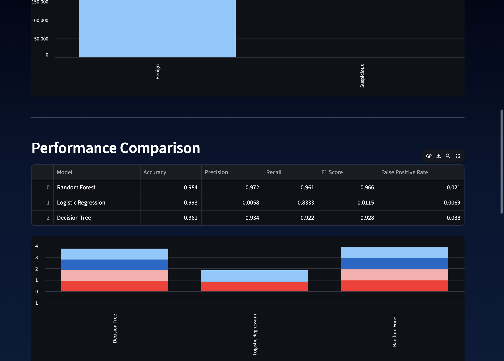
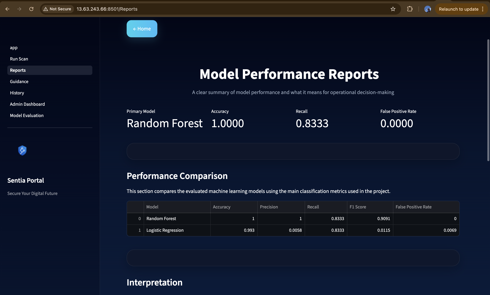

# Sentia Security Portal

A web-based cybersecurity platform integrating a Machine Learning-Based Intrusion Detection System (MLBIDS) to analyse network traffic, detect threats, and support security decision-making for small businesses.

---

### Project Purpose
This project demonstrates the design and implementation of a Machine Learning-Based Intrusion Detection System (MLBIDS) integrated into a business-focused security portal.

### Technologies Used
- Python (Streamlit)
- Scikit-learn (Machine Learning)
- Pandas / NumPy
- SQLite (Scan history storage)

### Live Demo
https://sentia-app-hdczdtqjdwhfftgkdxpvmg.streamlit.app/

### Features
- Run Security Scan (CSV upload & detection)
- View Model Performance Reports
- Access Security Guidance
- Track Scan History
- Admin Dashboard & Model Evaluation

---
## 📸 Application Preview  

### Dashboard  
System entry point for secure access and user authentication.  

### Threat Detection & Model Evaluation  
Machine learning models evaluated using key classification metrics.  

### Model Performance Reports  
Summary of detection results and system insights for decision-making.  

## © Sentia Technologies Limited
This project is developed as part of an academic submission.  
All rights reserved. This work must not be copied, reproduced, or reused without explicit permission from the author.
